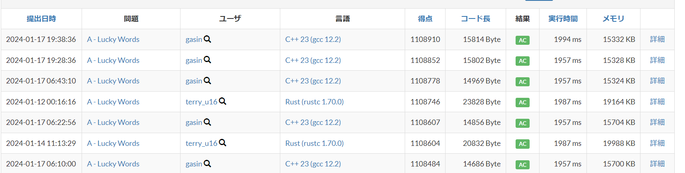

## AHC028

### 概要
短期のマラソンコンテストに参加したが結果がふるわなかったので、追実装をした

### やったこと
[公式のスライド](https://speakerdeck.com/terryu16/ahc028jie-shuo)がめちゃくちゃわかりやすいのでこれに従ってやった

オリジナルを入れようとしていたが、結局スライドの手法に収束してしまった

細かくは、文字列のマージ処理はしていなくて、細かい高速化周りは気持ち頑張った

3optなりをする際に、適当に選ぶとほとんど更新されないので、適切に枝刈りをするというのが最後のほうの本質パートだと思っている

### 未実装の改善アイディア
- 3optの境界を選ぶ際に、スライドにあるように隣接要素の相性を見て枝刈りをしているが、精緻化の余地があると思っている
  - スコアが高く出てしまっているので甘えているが、評価としては結構荒いと思っている
  - 現在得られてる解において、効率が悪い部分を集中的に選ぶロジックを入れたさがある
- DP 計算の高速化
  - 3optにおいて多くの区間は変更が起こらないので、前計算してうまく省略できないかと思っている
  - 最初の変更地点までのDPテーブルの使いまわしはしているが、もっと使いまわしできそう

### 所感 
- 焼きなましにおいて、更新頻度が高いから低いものを弾く簡易的なフィルタを入れるという考え方が知れてよかった
  - 焼きなましのライブラリを用意して、色々なメトリクスがパッと見えるようにしたい
