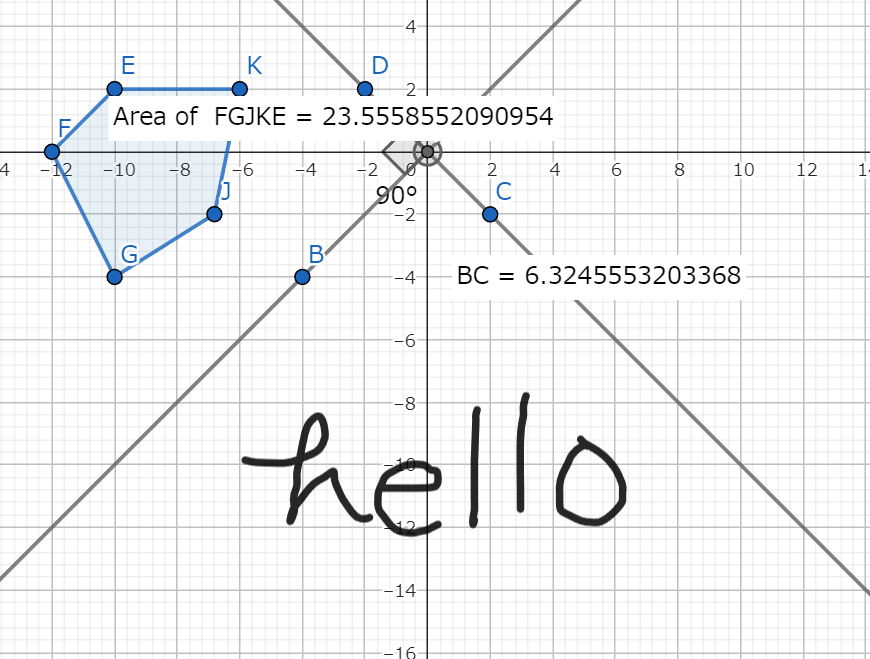
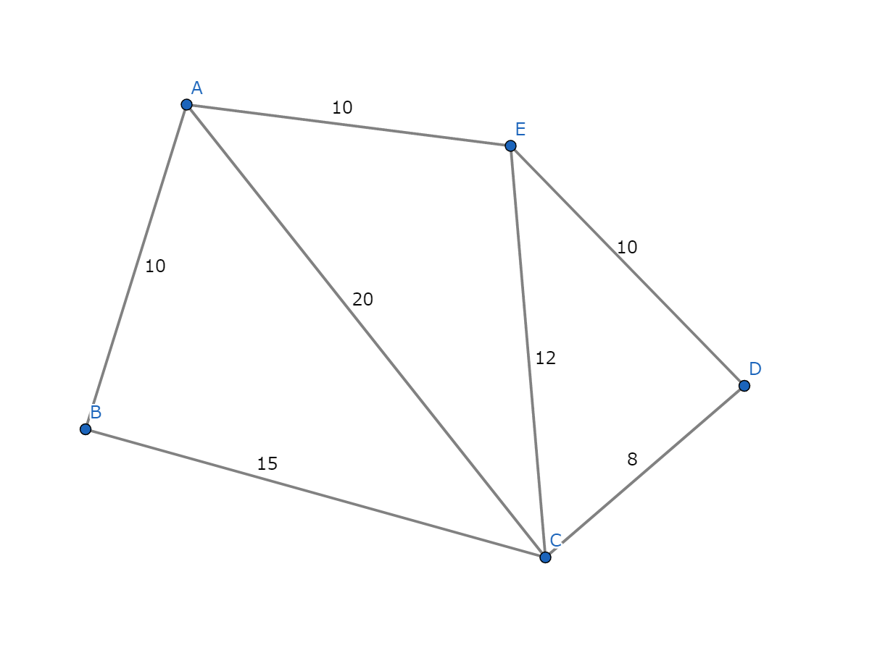
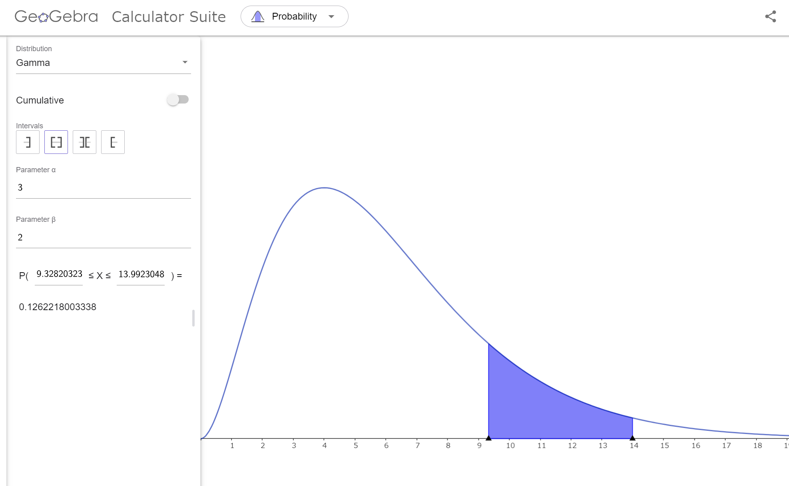

## GeoGebra

### 概要
動画を見ていたらこのツールの存在を知った

パワポなどでスライドを作る際に図を描くのはしばしば面倒だが、このツールはUIがかなり使いやすく、簡単に図を作成できる

### 使い方
ブラウザで https://www.geogebra.org/calculator にアクセスするとツールに触れる

クリックでポチポチしたら下みたいな図が比喩なしで1分かからずかける

特に2つ目のような図はたまに書くことがあるが、パワポとかで作ろうとすると無限の時間が溶けがち

有名分布もたくさん登録されていて、パラメータや値域をいじると可視化&その範囲に収まる確率を見せてくれる。これは普通にデータ分析してるときにあると便利そう

### 体感
触ってみるとわかるが、UIがかなりユーザフレンドリで触っていてかなり快適

よくある図形ツール（パワポとか draw.io とか）だと図形を配置するのが毎回手動で大変だが、このツールは半自動で綺麗にやってくれるのでかなり嬉しい

個人的に今後積極的に使うことになりそうな気がしている
